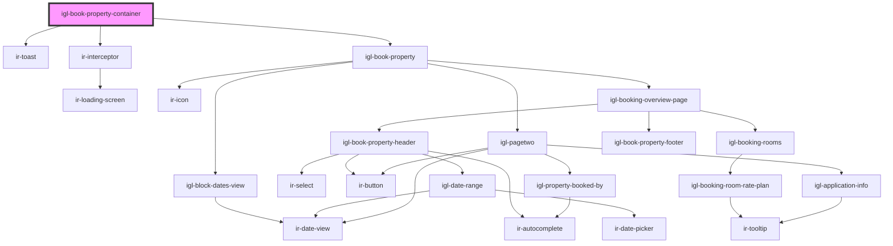

# igl-book-property-container

<!-- Auto Generated Below -->

## Properties

| Property     | Attribute    | Description | Type     | Default     |
| ------------ | ------------ | ----------- | -------- | ----------- |
| `baseurl`    | `baseurl`    |             | `string` | `''`        |
| `from_date`  | `from_date`  |             | `string` | `undefined` |
| `language`   | `language`   |             | `string` | `''`        |
| `propertyid` | `propertyid` |             | `number` | `undefined` |
| `ticket`     | `ticket`     |             | `string` | `''`        |
| `to_date`    | `to_date`    |             | `string` | `undefined` |

## Events

| Event              | Description | Type                |
| ------------------ | ----------- | ------------------- |
| `resetBookingData` |             | `CustomEvent<null>` |

## Dependencies

### Depends on

- [ir-toast](../ir-toast)
- [ir-interceptor](../ir-interceptor)
- [igl-book-property](../igloo-calendar/igl-book-property)

### Graph

----------------------------------------------

*Built with [StencilJS](https://stenciljs.com/)*
