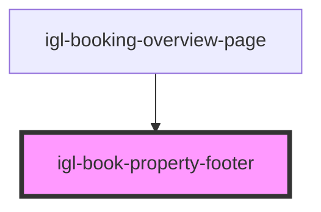

# igl-book-property-footer

<!-- Auto Generated Below -->

## Properties

| Property       | Attribute       | Description | Type      | Default     |
| -------------- | --------------- | ----------- | --------- | ----------- |
| `defaultTexts` | `default-texts` |             | `any`     | `undefined` |
| `disabled`     | `disabled`      |             | `boolean` | `true`      |
| `eventType`    | `event-type`    |             | `string`  | `undefined` |

## Events

| Event           | Description | Type                                           |
| --------------- | ----------- | ---------------------------------------------- |
| `buttonClicked` |             | `CustomEvent<{ key: TPropertyButtonsTypes; }>` |

## Dependencies

### Used by

 - [igl-booking-overview-page](../igl-booking-overview-page)

### Graph

----------------------------------------------

*Built with [StencilJS](https://stenciljs.com/)*
