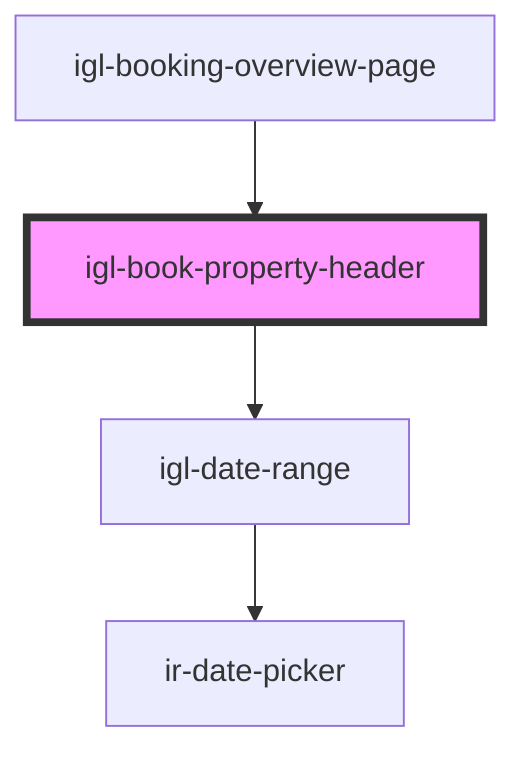

# igl-book-property-header

<!-- Auto Generated Below -->

## Properties

| Property                      | Attribute                   | Description | Type                                                                       | Default     |
| ----------------------------- | --------------------------- | ----------- | -------------------------------------------------------------------------- | ----------- |
| `adultChildConstraints`       | --                          |             | `{ adult_max_nbr: number; child_max_nbr: number; child_max_age: number; }` | `undefined` |
| `adultChildCount`             | --                          |             | `{ adult: number; child: number; }`                                        | `undefined` |
| `bookingData`                 | `booking-data`              |             | `any`                                                                      | `''`        |
| `bookingDataDefaultDateRange` | --                          |             | `{ [key: string]: any; }`                                                  | `undefined` |
| `message`                     | `message`                   |             | `string`                                                                   | `undefined` |
| `showSplitBookingOption`      | `show-split-booking-option` |             | `boolean`                                                                  | `false`     |
| `sourceOptions`               | --                          |             | `TSourceOptions[]`                                                         | `[]`        |
| `splitBookingId`              | `split-booking-id`          |             | `any`                                                                      | `''`        |
| `splitBookings`               | --                          |             | `any[]`                                                                    | `undefined` |

## Events

| Event                        | Description | Type                                           |
| ---------------------------- | ----------- | ---------------------------------------------- |
| `adultChild`                 |             | `CustomEvent<any>`                             |
| `buttonClicked`              |             | `CustomEvent<{ key: TPropertyButtonsTypes; }>` |
| `checkClicked`               |             | `CustomEvent<any>`                             |
| `sourceDropDownChange`       |             | `CustomEvent<string>`                          |
| `splitBookingDropDownChange` |             | `CustomEvent<any>`                             |

## Dependencies

### Used by

 - [igl-booking-overview-page](../igl-booking-overview-page)

### Depends on

- [igl-date-range](../../igl-date-range)

### Graph

----------------------------------------------

*Built with [StencilJS](https://stenciljs.com/)*
