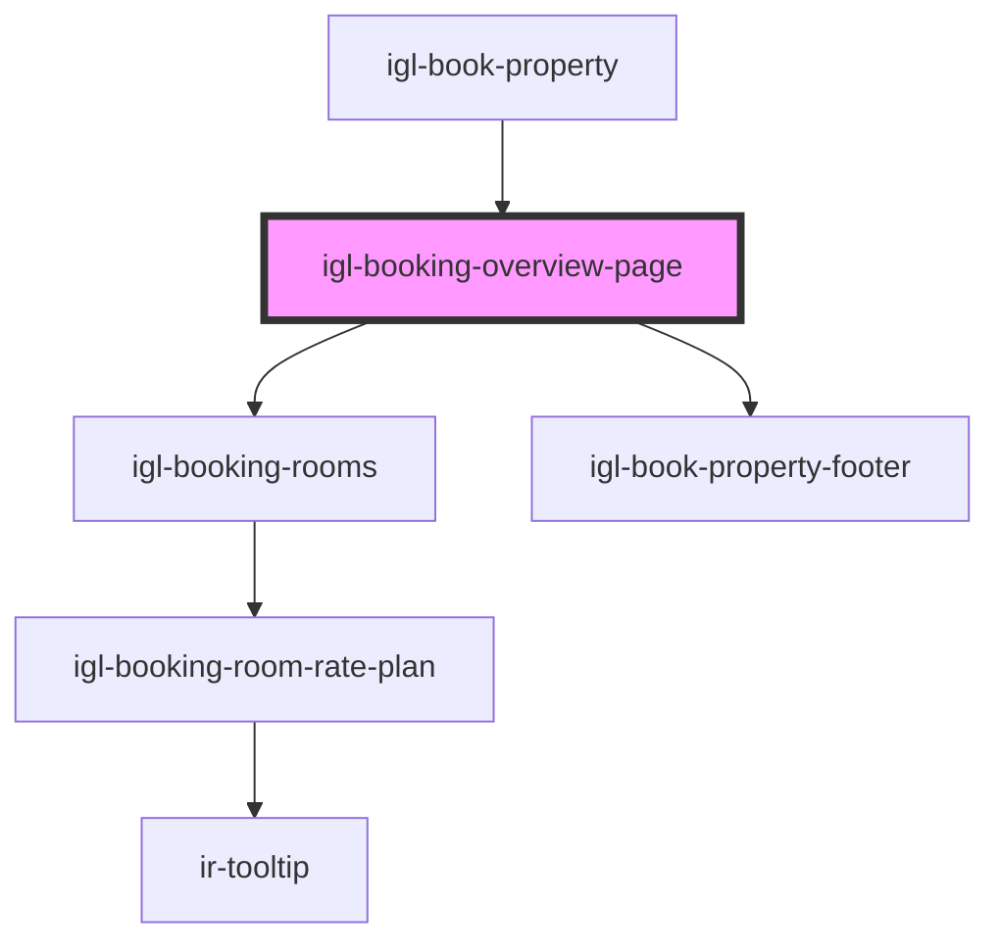

# igl-booking-overview-page

<!-- Auto Generated Below -->

## Properties

| Property                 | Attribute                   | Description | Type      | Default     |
| ------------------------ | --------------------------- | ----------- | --------- | ----------- |
| `bookingData`            | `booking-data`              |             | `any`     | `undefined` |
| `currency`               | `currency`                  |             | `any`     | `undefined` |
| `dateRangeData`          | `date-range-data`           |             | `any`     | `undefined` |
| `eventType`              | `event-type`                |             | `string`  | `undefined` |
| `message`                | `message`                   |             | `string`  | `undefined` |
| `ratePricingMode`        | `rate-pricing-mode`         |             | `any`     | `undefined` |
| `selectedRooms`          | `selected-rooms`            |             | `any`     | `{}`        |
| `showSplitBookingOption` | `show-split-booking-option` |             | `boolean` | `undefined` |

## Events

| Event             | Description | Type                              |
| ----------------- | ----------- | --------------------------------- |
| `buttonClicked`   |             | `CustomEvent<"cancel" \| "next">` |
| `dateRangeSelect` |             | `CustomEvent<any>`                |
| `roomsDataUpdate` |             | `CustomEvent<any>`                |

## Dependencies

### Used by

 - [igl-book-property](..)

### Depends on

- [igl-booking-rooms](../../igl-booking-rooms)
- [igl-book-property-footer](../igl-book-property-footer)

### Graph

----------------------------------------------

*Built with [StencilJS](https://stenciljs.com/)*
