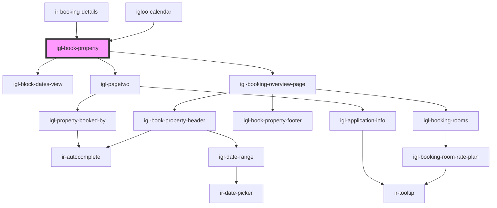

# igl-book-property

<!-- Auto Generated Below -->

## Properties

| Property                | Attribute                 | Description | Type                                                                       | Default     |
| ----------------------- | ------------------------- | ----------- | -------------------------------------------------------------------------- | ----------- |
| `adultChildConstraints` | --                        |             | `{ adult_max_nbr: number; child_max_nbr: number; child_max_age: number; }` | `undefined` |
| `allowedBookingSources` | `allowed-booking-sources` |             | `any`                                                                      | `undefined` |
| `bookingData`           | --                        |             | `{ [key: string]: any; }`                                                  | `undefined` |
| `countryNodeList`       | `country-node-list`       |             | `any`                                                                      | `undefined` |
| `currency`              | --                        |             | `{ id: number; code: string; }`                                            | `undefined` |
| `language`              | `language`                |             | `string`                                                                   | `undefined` |
| `propertyid`            | `propertyid`              |             | `number`                                                                   | `undefined` |
| `showPaymentDetails`    | `show-payment-details`    |             | `boolean`                                                                  | `false`     |

## Events

| Event                | Description | Type                                                          |
| -------------------- | ----------- | ------------------------------------------------------------- |
| `blockedCreated`     |             | `CustomEvent<RoomBlockDetails>`                               |
| `bookingCreated`     |             | `CustomEvent<{ pool?: string; data: RoomBookingDetails[]; }>` |
| `closeBookingWindow` |             | `CustomEvent<{ [key: string]: any; }>`                        |
| `editFinished`       |             | `CustomEvent<null>`                                           |

## Dependencies

### Used by

 - [igloo-calendar](..)
 - [ir-booking-details](../../ir-booking-details)

### Depends on

- [igl-block-dates-view](../igl-block-dates-view)
- [igl-booking-overview-page](igl-booking-overview-page)
- [igl-pagetwo](../igl-pagetwo)

### Graph

----------------------------------------------

*Built with [StencilJS](https://stenciljs.com/)*
