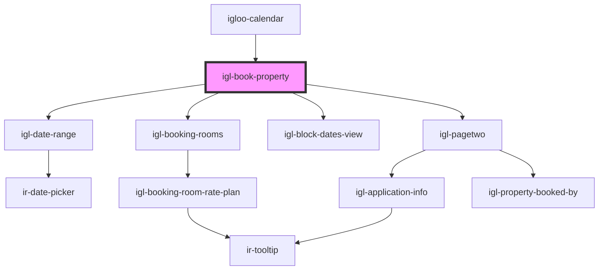

# igl-book-property

<!-- Auto Generated Below -->

## Properties

| Property          | Attribute           | Description | Type                            | Default     |
| ----------------- | ------------------- | ----------- | ------------------------------- | ----------- |
| `bookingData`     | --                  |             | `{ [key: string]: any; }`       | `undefined` |
| `countryNodeList` | `country-node-list` |             | `any`                           | `undefined` |
| `currency`        | --                  |             | `{ id: number; code: string; }` | `undefined` |
| `language`        | `language`          |             | `string`                        | `undefined` |
| `propertyid`      | `propertyid`        |             | `number`                        | `undefined` |

## Events

| Event                | Description | Type                                   |
| -------------------- | ----------- | -------------------------------------- |
| `closeBookingWindow` |             | `CustomEvent<{ [key: string]: any; }>` |

## Dependencies

### Used by

 - [igloo-calendar](..)

### Depends on

- [igl-date-range](../igl-date-range)
- [igl-booking-rooms](../igl-booking-rooms)
- [igl-block-dates-view](../igl-block-dates-view)
- [igl-pagetwo](../igl-pagetwo)

### Graph

----------------------------------------------

*Built with [StencilJS](https://stenciljs.com/)*
