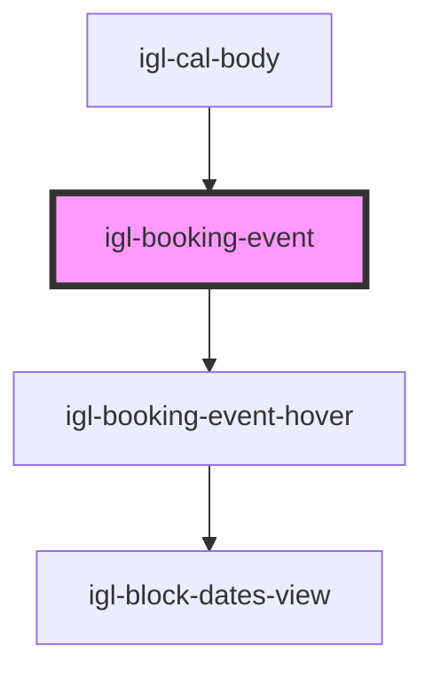

# igl-booking-event

<!-- Auto Generated Below -->

## Properties

| Property             | Attribute            | Description | Type                      | Default     |
| -------------------- | -------------------- | ----------- | ------------------------- | ----------- |
| `allBookingEvents`   | --                   |             | `{ [key: string]: any; }` | `[]`        |
| `bookingEvent`       | --                   |             | `{ [key: string]: any; }` | `undefined` |
| `countryNodeList`    | `country-node-list`  |             | `any`                     | `undefined` |
| `currency`           | `currency`           |             | `any`                     | `undefined` |
| `is_vacation_rental` | `is_vacation_rental` |             | `boolean`                 | `false`     |
| `language`           | `language`           |             | `string`                  | `undefined` |

## Events

| Event               | Description | Type               |
| ------------------- | ----------- | ------------------ |
| `dragOverEventData` |             | `CustomEvent<any>` |
| `hideBubbleInfo`    |             | `CustomEvent<any>` |
| `updateEventData`   |             | `CustomEvent<any>` |

## Dependencies

### Used by

 - [igl-cal-body](../igl-cal-body)

### Depends on

- [igl-booking-event-hover](../igl-booking-event-hover)

### Graph

----------------------------------------------

*Built with [StencilJS](https://stenciljs.com/)*
