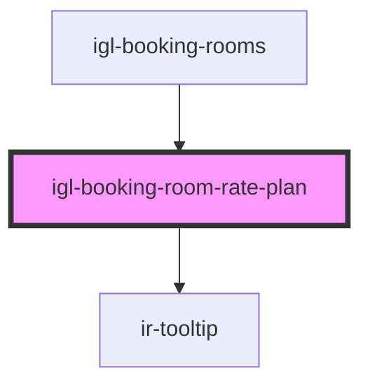

# igl-booking-room-rate-plan

<!-- Auto Generated Below -->

## Properties

| Property              | Attribute               | Description | Type                      | Default          |
| --------------------- | ----------------------- | ----------- | ------------------------- | ---------------- |
| `bookingType`         | `booking-type`          |             | `string`                  | `'PLUS_BOOKING'` |
| `currency`            | `currency`              |             | `any`                     | `undefined`      |
| `dateDifference`      | `date-difference`       |             | `number`                  | `undefined`      |
| `defaultData`         | --                      |             | `{ [key: string]: any; }` | `undefined`      |
| `fullyBlocked`        | `fully-blocked`         |             | `boolean`                 | `undefined`      |
| `ratePlanData`        | --                      |             | `{ [key: string]: any; }` | `undefined`      |
| `ratePricingMode`     | --                      |             | `any[]`                   | `[]`             |
| `totalAvailableRooms` | `total-available-rooms` |             | `number`                  | `undefined`      |

## Events

| Event                   | Description | Type                                   |
| ----------------------- | ----------- | -------------------------------------- |
| `dataUpdateEvent`       |             | `CustomEvent<{ [key: string]: any; }>` |
| `gotoSplitPageTwoEvent` |             | `CustomEvent<{ [key: string]: any; }>` |

## Dependencies

### Used by

 - [igl-booking-rooms](../igl-booking-rooms)

### Depends on

- [ir-tooltip](../../ir-tooltip)

### Graph

----------------------------------------------

*Built with [StencilJS](https://stenciljs.com/)*
