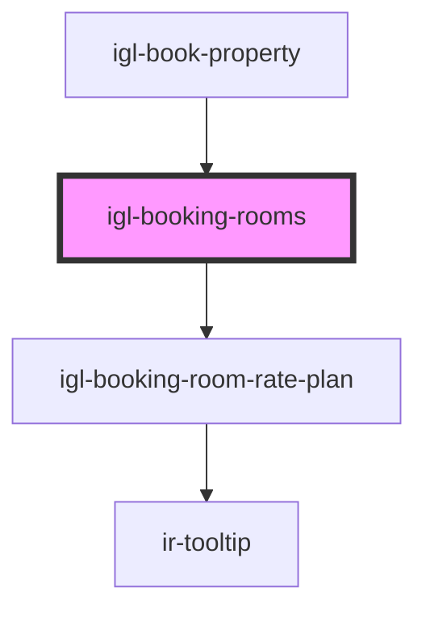

# igl-booking-rooms

<!-- Auto Generated Below -->

## Properties

| Property          | Attribute         | Description | Type                      | Default          |
| ----------------- | ----------------- | ----------- | ------------------------- | ---------------- |
| `bookingType`     | `booking-type`    |             | `string`                  | `"PLUS_BOOKING"` |
| `currency`        | `currency`        |             | `any`                     | `undefined`      |
| `dateDifference`  | `date-difference` |             | `number`                  | `undefined`      |
| `defaultData`     | --                |             | `{ [key: string]: any; }` | `undefined`      |
| `ratePricingMode` | --                |             | `any[]`                   | `[]`             |
| `roomTypeData`    | --                |             | `{ [key: string]: any; }` | `undefined`      |

## Events

| Event             | Description | Type                                   |
| ----------------- | ----------- | -------------------------------------- |
| `dataUpdateEvent` |             | `CustomEvent<{ [key: string]: any; }>` |

## Dependencies

### Used by

 - [igl-book-property](../igl-book-property)

### Depends on

- [igl-booking-room-rate-plan](../igl-booking-room-rate-plan)

### Graph

----------------------------------------------

*Built with [StencilJS](https://stenciljs.com/)*
