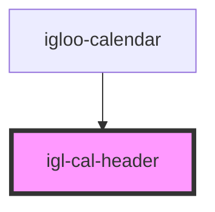

# igl-cal-header

<!-- Auto Generated Below -->

## Properties

| Property       | Attribute    | Description | Type                      | Default     |
| -------------- | ------------ | ----------- | ------------------------- | ----------- |
| `calendarData` | --           |             | `{ [key: string]: any; }` | `undefined` |
| `propertyid`   | `propertyid` |             | `number`                  | `undefined` |
| `to_date`      | `to_date`    |             | `string`                  | `undefined` |
| `today`        | --           |             | `String`                  | `undefined` |

## Events

| Event                  | Description | Type                                   |
| ---------------------- | ----------- | -------------------------------------- |
| `gotoRoomEvent`        |             | `CustomEvent<{ [key: string]: any; }>` |
| `gotoToBeAssignedDate` |             | `CustomEvent<{ [key: string]: any; }>` |
| `optionEvent`          |             | `CustomEvent<{ [key: string]: any; }>` |

## Dependencies

### Used by

 - [igloo-calendar](..)

### Graph

----------------------------------------------

*Built with [StencilJS](https://stenciljs.com/)*
