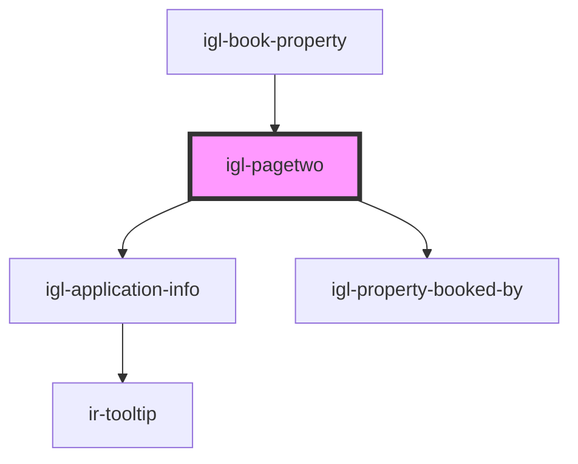

# igl-pagetwo

<!-- Auto Generated Below -->

## Properties

| Property                 | Attribute                   | Description | Type                      | Default     |
| ------------------------ | --------------------------- | ----------- | ------------------------- | ----------- |
| `bedPreferenceType`      | `bed-preference-type`       |             | `any`                     | `undefined` |
| `bookedByInfoData`       | --                          |             | `{ [key: string]: any; }` | `undefined` |
| `bookingData`            | --                          |             | `{ [key: string]: any; }` | `undefined` |
| `countryNodeList`        | `country-node-list`         |             | `any`                     | `undefined` |
| `dateRangeData`          | --                          |             | `{ [key: string]: any; }` | `undefined` |
| `isEditOrAddRoomEvent`   | `is-edit-or-add-room-event` |             | `boolean`                 | `undefined` |
| `isLoading`              | `is-loading`                |             | `string`                  | `undefined` |
| `language`               | `language`                  |             | `string`                  | `undefined` |
| `selectedRooms`          | `selected-rooms`            |             | `any`                     | `undefined` |
| `showSplitBookingOption` | `show-split-booking-option` |             | `boolean`                 | `undefined` |

## Events

| Event             | Description | Type                                                                  |
| ----------------- | ----------- | --------------------------------------------------------------------- |
| `buttonClicked`   |             | `CustomEvent<{ key: PageTwoButtonsTypes; data?: CustomEvent<any>; }>` |
| `dataUpdateEvent` |             | `CustomEvent<IPageTwoDataUpdateProps>`                                |

## Dependencies

### Used by

 - [igl-book-property](../igl-book-property)

### Depends on

- [igl-application-info](../igl-application-info)
- [igl-property-booked-by](../igl-property-booked-by)

### Graph

----------------------------------------------

*Built with [StencilJS](https://stenciljs.com/)*
