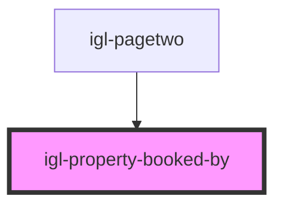

# igl-property-booked-by

<!-- Auto Generated Below -->

## Properties

| Property          | Attribute  | Description | Type                      | Default     |
| ----------------- | ---------- | ----------- | ------------------------- | ----------- |
| `countryNodeList` | --         |             | `ICountry[]`              | `[]`        |
| `defaultData`     | --         |             | `{ [key: string]: any; }` | `undefined` |
| `language`        | `language` |             | `string`                  | `undefined` |

## Events

| Event             | Description | Type                                   |
| ----------------- | ----------- | -------------------------------------- |
| `dataUpdateEvent` |             | `CustomEvent<{ [key: string]: any; }>` |

## Dependencies

### Used by

 - [igl-pagetwo](../igl-pagetwo)

### Graph

----------------------------------------------

*Built with [StencilJS](https://stenciljs.com/)*
