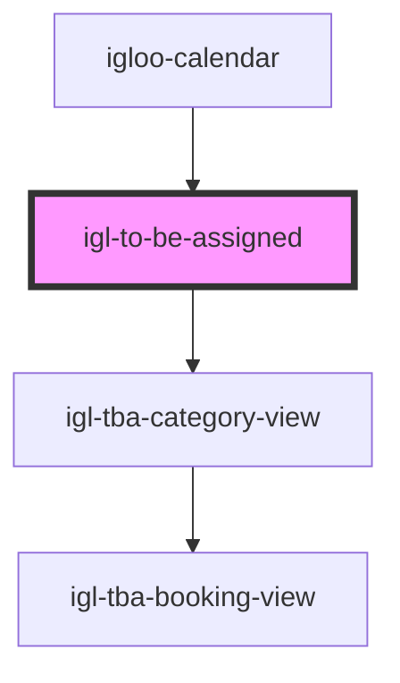

# igl-to-be-assigned

<!-- Auto Generated Below -->

## Properties

| Property         | Attribute         | Description | Type                      | Default                           |
| ---------------- | ----------------- | ----------- | ------------------------- | --------------------------------- |
| `calendarData`   | --                |             | `{ [key: string]: any; }` | `undefined`                       |
| `from_date`      | `from_date`       |             | `string`                  | `undefined`                       |
| `loadingMessage` | `loading-message` |             | `string`                  | `"Fetching For Unassigned Rooms"` |
| `propertyid`     | `propertyid`      |             | `number`                  | `undefined`                       |
| `to_date`        | `to_date`         |             | `string`                  | `undefined`                       |

## Events

| Event                               | Description | Type                                   |
| ----------------------------------- | ----------- | -------------------------------------- |
| `addToBeAssignedEvent`              |             | `CustomEvent<any>`                     |
| `highlightToBeAssignedBookingEvent` |             | `CustomEvent<any>`                     |
| `optionEvent`                       |             | `CustomEvent<{ [key: string]: any; }>` |
| `reduceAvailableUnitEvent`          |             | `CustomEvent<{ [key: string]: any; }>` |
| `showBookingPopup`                  |             | `CustomEvent<any>`                     |

## Dependencies

### Used by

 - [igloo-calendar](..)

### Depends on

- [igl-tba-category-view](igl-tba-category-view)

### Graph

----------------------------------------------

*Built with [StencilJS](https://stenciljs.com/)*
