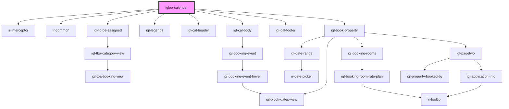

# igloo-calendar

<!-- Auto Generated Below -->

## Properties

| Property         | Attribute         | Description | Type     | Default     |
| ---------------- | ----------------- | ----------- | -------- | ----------- |
| `baseurl`        | `baseurl`         |             | `string` | `undefined` |
| `currencyName`   | `currency-name`   |             | `string` | `undefined` |
| `from_date`      | `from_date`       |             | `string` | `undefined` |
| `language`       | `language`        |             | `string` | `undefined` |
| `loadingMessage` | `loading-message` |             | `string` | `undefined` |
| `propertyid`     | `propertyid`      |             | `number` | `undefined` |
| `ticket`         | `ticket`          |             | `string` | `""`        |
| `to_date`        | `to_date`         |             | `string` | `undefined` |

## Events

| Event                      | Description | Type               |
| -------------------------- | ----------- | ------------------ |
| `dragOverHighlightElement` |             | `CustomEvent<any>` |
| `moveBookingTo`            |             | `CustomEvent<any>` |

## Dependencies

### Depends on

- [ir-interceptor](../ir-interceptor)
- [ir-common](../ir-common)
- [igl-to-be-assigned](igl-to-be-assigned)
- [igl-legends](igl-legends)
- [igl-cal-header](igl-cal-header)
- [igl-cal-body](igl-cal-body)
- [igl-cal-footer](igl-cal-footer)
- [igl-book-property](igl-book-property)

### Graph

----------------------------------------------

*Built with [StencilJS](https://stenciljs.com/)*
