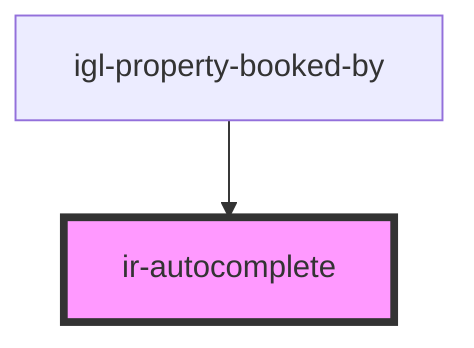

# ir-autocomplete

<!-- Auto Generated Below -->

## Properties

| Property      | Attribute     | Description | Type                                                      | Default     |
| ------------- | ------------- | ----------- | --------------------------------------------------------- | ----------- |
| `disabled`    | `disabled`    |             | `boolean`                                                 | `false`     |
| `duration`    | `duration`    |             | `number`                                                  | `300`       |
| `inputId`     | `input-id`    |             | `string`                                                  | `v4()`      |
| `name`        | `name`        |             | `string`                                                  | `''`        |
| `placeholder` | `placeholder` |             | `string`                                                  | `''`        |
| `propertyId`  | `property-id` |             | `number`                                                  | `undefined` |
| `required`    | `required`    |             | `boolean`                                                 | `false`     |
| `type`        | `type`        |             | `"email" \| "number" \| "password" \| "search" \| "text"` | `'text'`    |
| `value`       | `value`       |             | `string`                                                  | `undefined` |

## Events

| Event           | Description | Type                                           |
| --------------- | ----------- | ---------------------------------------------- |
| `comboboxValue` |             | `CustomEvent<{ key: string; data: unknown; }>` |
| `inputCleared`  |             | `CustomEvent<null>`                            |

## Dependencies

### Used by

 - [igl-property-booked-by](../igloo-calendar/igl-property-booked-by)

### Graph

----------------------------------------------

*Built with [StencilJS](https://stenciljs.com/)*
