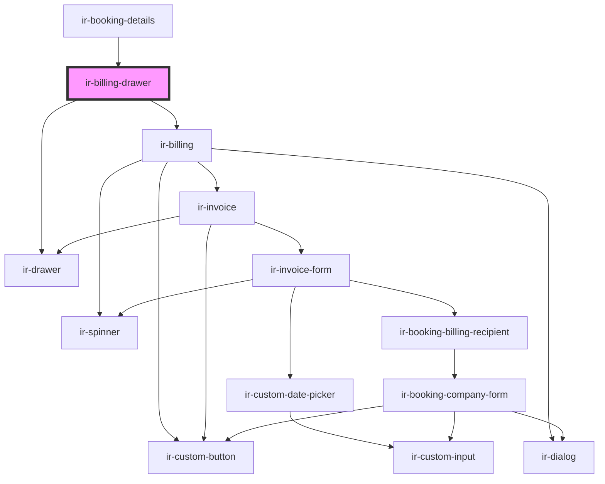

# ir-billing-drawer

<!-- Auto Generated Below -->

## Properties

| Property  | Attribute | Description                                                                                                                                                               | Type      | Default     |
| --------- | --------- | ------------------------------------------------------------------------------------------------------------------------------------------------------------------------- | --------- | ----------- |
| `booking` | --        | The booking object containing reservation and guest details that will be used to populate the billing view.                                                               | `Booking` | `undefined` |
| `open`    | `open`    | Controls whether the billing drawer is open or closed.  When `true`, the drawer becomes visible. When `false`, it is hidden.  This prop is reflected to the host element. | `boolean` | `undefined` |

## Events

| Event          | Description                                                                                                | Type                |
| -------------- | ---------------------------------------------------------------------------------------------------------- | ------------------- |
| `billingClose` | Emitted when the billing drawer has been closed.  Listen to this event to respond to drawer close actions. | `CustomEvent<void>` |

## Dependencies

### Used by

 - [ir-booking-details](../../ir-booking-details)

### Depends on

- [ir-drawer](../../ir-drawer)
- [ir-billing](..)

### Graph

----------------------------------------------

*Built with [StencilJS](https://stenciljs.com/)*
