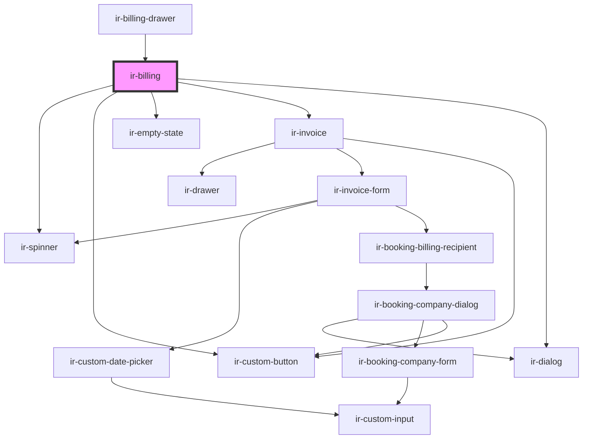

# ir-billing

<!-- Auto Generated Below -->

## Properties

| Property  | Attribute | Description | Type      | Default     |
| --------- | --------- | ----------- | --------- | ----------- |
| `booking` | --        |             | `Booking` | `undefined` |

## Events

| Event          | Description | Type                |
| -------------- | ----------- | ------------------- |
| `billingClose` |             | `CustomEvent<void>` |

## Dependencies

### Used by

 - [ir-billing-drawer](ir-billing-drawer)

### Depends on

- [ir-spinner](../ui/ir-spinner)
- [ir-custom-button](../ui/ir-custom-button)
- [ir-empty-state](../ir-empty-state)
- [ir-invoice](../ir-invoice)
- [ir-dialog](../ui/ir-dialog)

### Graph

----------------------------------------------

*Built with [StencilJS](https://stenciljs.com/)*
