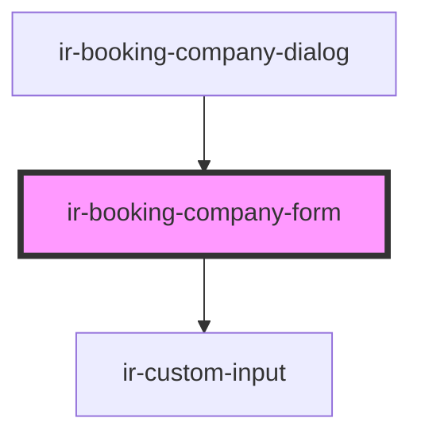

# ir-booking-company-form

<!-- Auto Generated Below -->

## Properties

| Property  | Attribute | Description | Type      | Default     |
| --------- | --------- | ----------- | --------- | ----------- |
| `booking` | --        |             | `Booking` | `undefined` |
| `formId`  | `form-id` |             | `string`  | `undefined` |

## Events

| Event             | Description | Type                   |
| ----------------- | ----------- | ---------------------- |
| `resetBookingEvt` |             | `CustomEvent<Booking>` |

## Dependencies

### Used by

 - [ir-booking-company-dialog](..)

### Depends on

- [ir-custom-input](../../ui/ir-custom-input)

### Graph

----------------------------------------------

*Built with [StencilJS](https://stenciljs.com/)*
