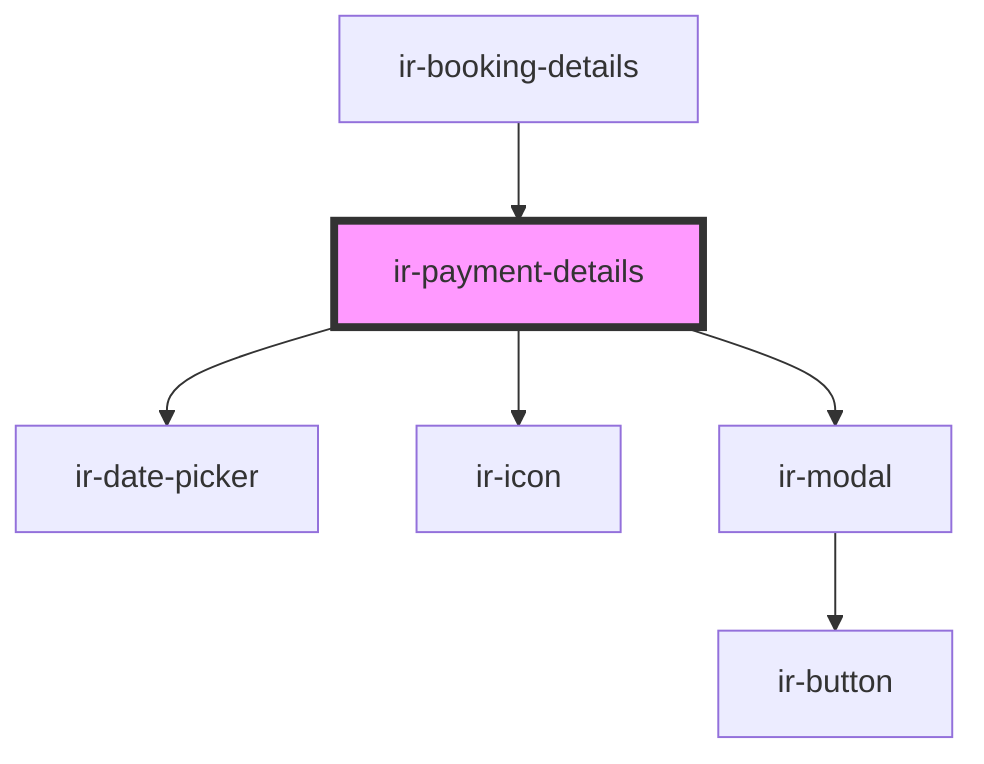

# ir-payment-details

<!-- Auto Generated Below -->

## Properties

| Property         | Attribute | Description | Type      | Default     |
| ---------------- | --------- | ----------- | --------- | ----------- |
| `bookingDetails` | --        |             | `Booking` | `undefined` |
| `defaultTexts`   | --        |             | `ILocale` | `undefined` |

## Events

| Event              | Description | Type                                                                                                 |
| ------------------ | ----------- | ---------------------------------------------------------------------------------------------------- |
| `resetBookingData` |             | `CustomEvent<null>`                                                                                  |
| `toast`            |             | `CustomEvent<ICustomToast & Partial<IToastWithButton> \| IDefaultToast & Partial<IToastWithButton>>` |

## Dependencies

### Used by

 - [ir-booking-details](..)

### Depends on

- [ir-date-picker](../../ir-date-picker)
- [ir-icon](../../ir-icon)
- [ir-modal](../../ir-modal)

### Graph

----------------------------------------------

*Built with [StencilJS](https://stenciljs.com/)*
