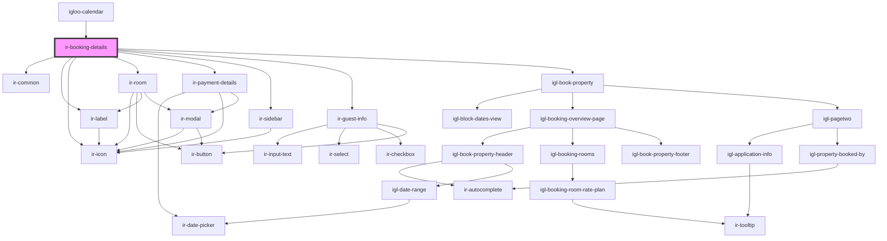

# ir-booking-details

<!-- Auto Generated Below -->

## Properties

| Property                  | Attribute                   | Description | Type             | Default     |
| ------------------------- | --------------------------- | ----------- | ---------------- | ----------- |
| `baseurl`                 | `baseurl`                   |             | `string`         | `''`        |
| `bookingDetails`          | `booking-details`           |             | `any`            | `null`      |
| `bookingNumber`           | `booking-number`            |             | `string`         | `''`        |
| `dropdownStatuses`        | `dropdown-statuses`         |             | `any`            | `[]`        |
| `editBookingItem`         | `edit-booking-item`         |             | `any`            | `undefined` |
| `hasCheckIn`              | `has-check-in`              |             | `boolean`        | `false`     |
| `hasCheckOut`             | `has-check-out`             |             | `boolean`        | `false`     |
| `hasDelete`               | `has-delete`                |             | `boolean`        | `false`     |
| `hasMenu`                 | `has-menu`                  |             | `boolean`        | `false`     |
| `hasPrint`                | `has-print`                 |             | `boolean`        | `false`     |
| `hasReceipt`              | `has-receipt`               |             | `boolean`        | `false`     |
| `hasRoomAdd`              | `has-room-add`              |             | `boolean`        | `false`     |
| `hasRoomDelete`           | `has-room-delete`           |             | `boolean`        | `false`     |
| `hasRoomEdit`             | `has-room-edit`             |             | `boolean`        | `false`     |
| `language`                | `language`                  |             | `string`         | `''`        |
| `languageAbreviation`     | `language-abreviation`      |             | `string`         | `''`        |
| `paymentDetailsUrl`       | `payment-details-url`       |             | `string`         | `''`        |
| `paymentExceptionMessage` | `payment-exception-message` |             | `string`         | `''`        |
| `propertyid`              | `propertyid`                |             | `number`         | `undefined` |
| `setupDataCountries`      | --                          |             | `selectOption[]` | `null`      |
| `setupDataCountriesCode`  | --                          |             | `selectOption[]` | `null`      |
| `statusCodes`             | `status-codes`              |             | `any`            | `[]`        |
| `ticket`                  | `ticket`                    |             | `string`         | `''`        |

## Events

| Event                | Description | Type                     |
| -------------------- | ----------- | ------------------------ |
| `handleAddPayment`   |             | `CustomEvent<any>`       |
| `handleDeleteClick`  |             | `CustomEvent<any>`       |
| `handleMenuClick`    |             | `CustomEvent<any>`       |
| `handlePrintClick`   |             | `CustomEvent<any>`       |
| `handleReceiptClick` |             | `CustomEvent<any>`       |
| `handleRoomAdd`      |             | `CustomEvent<any>`       |
| `handleRoomDelete`   |             | `CustomEvent<any>`       |
| `handleRoomEdit`     |             | `CustomEvent<any>`       |
| `sendDataToServer`   |             | `CustomEvent<guestInfo>` |

## Dependencies

### Used by

 - [igloo-calendar](../igloo-calendar)

### Depends on

- [ir-common](../ir-common)
- [ir-label](../ir-label)
- [ir-icon](../ir-icon)
- [ir-room](ir-room)
- [ir-payment-details](ir-payment-details)
- [ir-sidebar](../ir-sidebar)
- [ir-guest-info](../ir-guest-info)
- [igl-book-property](../igloo-calendar/igl-book-property)

### Graph

----------------------------------------------

*Built with [StencilJS](https://stenciljs.com/)*
