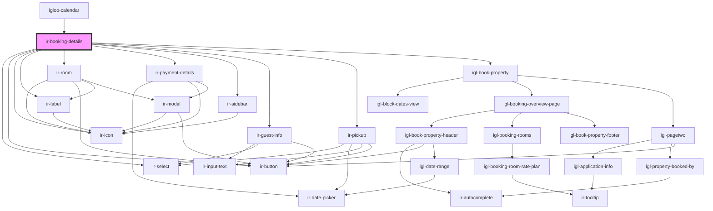

# ir-booking-details

<!-- Auto Generated Below -->

## Properties

| Property        | Attribute         | Description | Type      | Default     |
| --------------- | ----------------- | ----------- | --------- | ----------- |
| `baseurl`       | `baseurl`         |             | `string`  | `''`        |
| `bookingNumber` | `booking-number`  |             | `string`  | `''`        |
| `hasCheckIn`    | `has-check-in`    |             | `boolean` | `false`     |
| `hasCheckOut`   | `has-check-out`   |             | `boolean` | `false`     |
| `hasDelete`     | `has-delete`      |             | `boolean` | `false`     |
| `hasMenu`       | `has-menu`        |             | `boolean` | `false`     |
| `hasPrint`      | `has-print`       |             | `boolean` | `false`     |
| `hasReceipt`    | `has-receipt`     |             | `boolean` | `false`     |
| `hasRoomAdd`    | `has-room-add`    |             | `boolean` | `false`     |
| `hasRoomDelete` | `has-room-delete` |             | `boolean` | `false`     |
| `hasRoomEdit`   | `has-room-edit`   |             | `boolean` | `false`     |
| `language`      | `language`        |             | `string`  | `''`        |
| `propertyid`    | `propertyid`      |             | `number`  | `undefined` |
| `ticket`        | `ticket`          |             | `string`  | `''`        |

## Events

| Event   | Description | Type                                                                                                 |
| ------- | ----------- | ---------------------------------------------------------------------------------------------------- |
| `toast` |             | `CustomEvent<ICustomToast & Partial<IToastWithButton> \| IDefaultToast & Partial<IToastWithButton>>` |

## Dependencies

### Used by

 - [igloo-calendar](../igloo-calendar)

### Depends on

- [ir-select](../ir-select)
- [ir-button](../ir-button)
- [ir-icon](../ir-icon)
- [ir-label](../ir-label)
- [ir-room](ir-room)
- [ir-payment-details](ir-payment-details)
- [ir-sidebar](../ir-sidebar)
- [ir-guest-info](../ir-guest-info)
- [ir-pickup](ir-pickup)
- [igl-book-property](../igloo-calendar/igl-book-property)

### Graph

----------------------------------------------

*Built with [StencilJS](https://stenciljs.com/)*
