# ir-button

<!-- Auto Generated Below -->

## Properties

| Property       | Attribute      | Description | Type                                                                                            | Default     |
| -------------- | -------------- | ----------- | ----------------------------------------------------------------------------------------------- | ----------- |
| `btn_block`    | `btn_block`    |             | `boolean`                                                                                       | `true`      |
| `btn_color`    | `btn_color`    |             | `"danger" \| "dark" \| "info" \| "light" \| "primary" \| "secondary" \| "success" \| "warning"` | `'primary'` |
| `btn_disabled` | `btn_disabled` |             | `boolean`                                                                                       | `false`     |
| `btn_id`       | `btn_id`       |             | `string`                                                                                        | `v4()`      |
| `btn_styles`   | `btn_styles`   |             | `string`                                                                                        | `undefined` |
| `btn_type`     | `btn_type`     |             | `string`                                                                                        | `'button'`  |
| `icon`         | `icon`         |             | `string`                                                                                        | `'ft-save'` |
| `isLoading`    | `is-loading`   |             | `boolean`                                                                                       | `false`     |
| `name`         | `name`         |             | `string`                                                                                        | `undefined` |
| `size`         | `size`         |             | `"lg" \| "md" \| "sm"`                                                                          | `'md'`      |
| `text`         | `text`         |             | `any`                                                                                           | `undefined` |
| `textSize`     | `text-size`    |             | `"lg" \| "md" \| "sm"`                                                                          | `'md'`      |

## Events

| Event          | Description | Type               |
| -------------- | ----------- | ------------------ |
| `clickHanlder` |             | `CustomEvent<any>` |

## Dependencies

### Used by

 - [igl-book-property-header](../igloo-calendar/igl-book-property/igl-book-property-header)
 - [igl-pagetwo](../igloo-calendar/igl-pagetwo)
 - [ir-booking-details](../ir-booking-details)
 - [ir-booking-listing](../ir-booking-listing)
 - [ir-channel](../ir-channel)
 - [ir-channel-editor](../ir-channel/ir-channel-editor)
 - [ir-delete-modal](../ir-housekeeping/ir-delete-modal)
 - [ir-guest-info](../ir-guest-info)
 - [ir-hk-tasks](../ir-housekeeping/ir-hk-tasks)
 - [ir-hk-unassigned-units](../ir-housekeeping/ir-hk-unassigned-units)
 - [ir-hk-user](../ir-housekeeping/ir-hk-user)
 - [ir-listing-modal](../ir-booking-listing/ir-listing-modal)
 - [ir-modal](../ir-modal)
 - [ir-pickup](../ir-booking-details/ir-pickup)
 - [ir-room](../ir-booking-details/ir-room)
 - [ir-room-nights](../ir-room-nights)

### Graph

```mermaid
graph TD;
  igl-book-property-header --> ir-button
  igl-pagetwo --> ir-button
  ir-booking-details --> ir-button
  ir-booking-listing --> ir-button
  ir-channel --> ir-button
  ir-channel-editor --> ir-button
  ir-delete-modal --> ir-button
  ir-guest-info --> ir-button
  ir-hk-tasks --> ir-button
  ir-hk-unassigned-units --> ir-button
  ir-hk-user --> ir-button
  ir-listing-modal --> ir-button
  ir-modal --> ir-button
  ir-pickup --> ir-button
  ir-room --> ir-button
  ir-room-nights --> ir-button
  style ir-button fill:#f9f,stroke:#333,stroke-width:4px
```

----------------------------------------------

*Built with [StencilJS](https://stenciljs.com/)*
