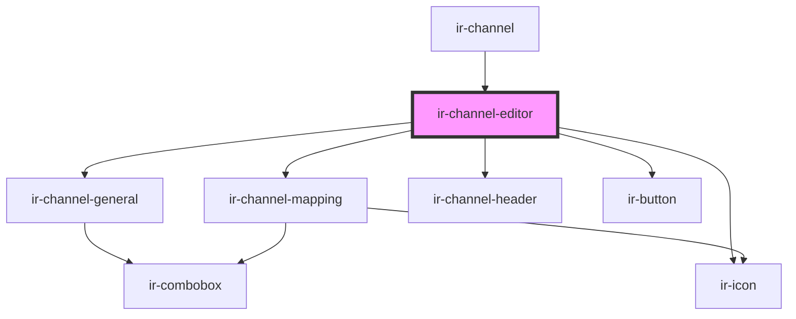

# ir-channel-editor

<!-- Auto Generated Below -->

## Properties

| Property         | Attribute        | Description | Type                 | Default |
| ---------------- | ---------------- | ----------- | -------------------- | ------- |
| `channel_status` | `channel_status` |             | `"create" \| "edit"` | `null`  |

## Events

| Event          | Description | Type                |
| -------------- | ----------- | ------------------- |
| `closeSideBar` |             | `CustomEvent<null>` |

## Dependencies

### Used by

 - [ir-channel](..)

### Depends on

- [ir-channel-general](../ir-channel-general)
- [ir-channel-mapping](../ir-channel-mapping)
- [ir-icon](../../ir-icon)
- [ir-channel-header](../ir-channel-header)
- [ir-button](../../ir-button)

### Graph

----------------------------------------------

*Built with [StencilJS](https://stenciljs.com/)*
