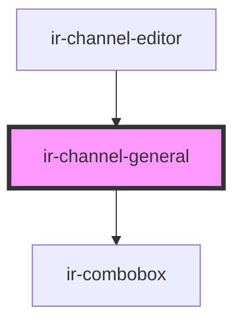

# ir-channel-general

<!-- Auto Generated Below -->

## Properties

| Property         | Attribute        | Description | Type                 | Default |
| ---------------- | ---------------- | ----------- | -------------------- | ------- |
| `channel_status` | `channel_status` |             | `"create" \| "edit"` | `null`  |

## Dependencies

### Used by

 - [ir-channel-editor](../ir-channel-editor)

### Depends on

- [ir-combobox](../../ir-combobox)

### Graph

----------------------------------------------

*Built with [StencilJS](https://stenciljs.com/)*
