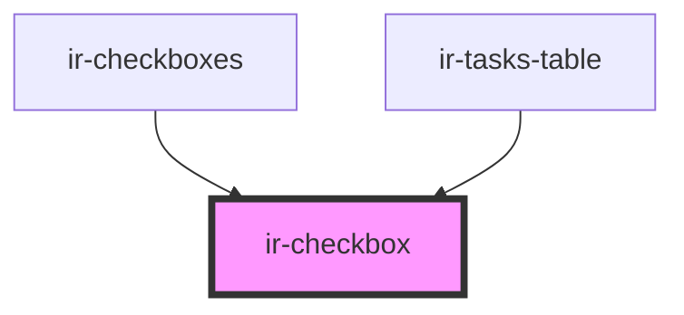

# ir-checkbox

<!-- Auto Generated Below -->

## Properties

| Property     | Attribute     | Description | Type      | Default     |
| ------------ | ------------- | ----------- | --------- | ----------- |
| `checkboxId` | `checkbox-id` |             | `string`  | `v4()`      |
| `checked`    | `checked`     |             | `boolean` | `false`     |
| `disabled`   | `disabled`    |             | `boolean` | `undefined` |
| `label`      | `label`       |             | `string`  | `undefined` |
| `name`       | `name`        |             | `string`  | `undefined` |

## Events

| Event         | Description | Type                   |
| ------------- | ----------- | ---------------------- |
| `checkChange` |             | `CustomEvent<boolean>` |

## Dependencies

### Used by

 - [ir-checkboxes](../ir-checkboxes)
 - [ir-tasks-table](../ir-housekeeping/ir-hk-tasks/ir-tasks-table)

### Graph

----------------------------------------------

*Built with [StencilJS](https://stenciljs.com/)*
