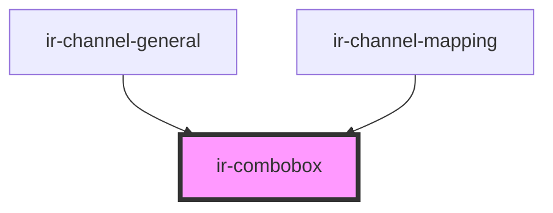

# ir-combobox

<!-- Auto Generated Below -->

## Properties

| Property      | Attribute     | Description | Type                              | Default     |
| ------------- | ------------- | ----------- | --------------------------------- | ----------- |
| `autoFocus`   | `auto-focus`  |             | `boolean`                         | `false`     |
| `data`        | --            |             | `{ id: string; name: string; }[]` | `[]`        |
| `disabled`    | `disabled`    |             | `boolean`                         | `false`     |
| `duration`    | `duration`    |             | `number`                          | `300`       |
| `input_id`    | `input_id`    |             | `string`                          | `''`        |
| `placeholder` | `placeholder` |             | `string`                          | `undefined` |
| `value`       | `value`       |             | `string`                          | `undefined` |

## Events

| Event                 | Description | Type                                                                                                 |
| --------------------- | ----------- | ---------------------------------------------------------------------------------------------------- |
| `comboboxValueChange` |             | `CustomEvent<{ key: string; data: unknown; }>`                                                       |
| `inputCleared`        |             | `CustomEvent<null>`                                                                                  |
| `toast`               |             | `CustomEvent<ICustomToast & Partial<IToastWithButton> \| IDefaultToast & Partial<IToastWithButton>>` |

## Dependencies

### Used by

 - [ir-channel-general](../ir-channel/ir-channel-general)
 - [ir-channel-mapping](../ir-channel/ir-channel-mapping)

### Graph

----------------------------------------------

*Built with [StencilJS](https://stenciljs.com/)*
