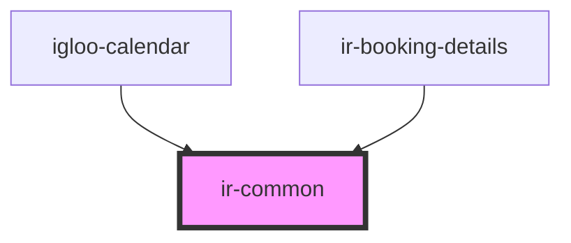

# ir-common

<!-- Auto Generated Below -->

## Properties

| Property         | Attribute         | Description | Type     | Default |
| ---------------- | ----------------- | ----------- | -------- | ------- |
| `extraResources` | `extra-resources` |             | `string` | `''`    |

## Dependencies

### Used by

 - [igloo-calendar](../igloo-calendar)
 - [ir-booking-details](../ir-booking-details)

### Graph

----------------------------------------------

*Built with [StencilJS](https://stenciljs.com/)*
