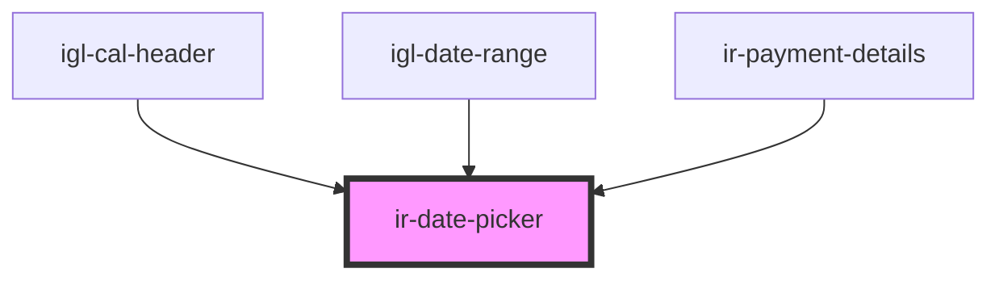

# ir-date-picker

<!-- Auto Generated Below -->

## Properties

| Property           | Attribute            | Description | Type                                                            | Default                                                                                                                      |
| ------------------ | -------------------- | ----------- | --------------------------------------------------------------- | ---------------------------------------------------------------------------------------------------------------------------- |
| `applyLabel`       | `apply-label`        |             | `string`                                                        | `'Apply'`                                                                                                                    |
| `autoApply`        | `auto-apply`         |             | `boolean`                                                       | `undefined`                                                                                                                  |
| `cancelLabel`      | `cancel-label`       |             | `string`                                                        | `'Cancel'`                                                                                                                   |
| `customRangeLabel` | `custom-range-label` |             | `string`                                                        | `'Custom'`                                                                                                                   |
| `daysOfWeek`       | --                   |             | `string[]`                                                      | `['Su', 'Mo', 'Tu', 'We', 'Th', 'Fr', 'Sa']`                                                                                 |
| `disabled`         | `disabled`           |             | `boolean`                                                       | `false`                                                                                                                      |
| `firstDay`         | `first-day`          |             | `number`                                                        | `1`                                                                                                                          |
| `format`           | `format`             |             | `string`                                                        | `'MMM DD, YYYY'`                                                                                                             |
| `fromDate`         | --                   |             | `Date`                                                          | `undefined`                                                                                                                  |
| `fromLabel`        | `from-label`         |             | `string`                                                        | `'Form'`                                                                                                                     |
| `maxSpan`          | `max-span`           |             | `Duration \| DurationInputObject \| FromTo \| number \| string` | `{     days: 240,   }`                                                                                                       |
| `minDate`          | `min-date`           |             | `string`                                                        | `undefined`                                                                                                                  |
| `monthNames`       | --                   |             | `string[]`                                                      | `['January', 'February', 'March', 'April', 'May', 'June', 'July', 'August', 'September', 'October', 'November', 'December']` |
| `opens`            | `opens`              |             | `"center" \| "left" \| "right"`                                 | `undefined`                                                                                                                  |
| `separator`        | `separator`          |             | `string`                                                        | `' - '`                                                                                                                      |
| `singleDatePicker` | `single-date-picker` |             | `boolean`                                                       | `false`                                                                                                                      |
| `toDate`           | --                   |             | `Date`                                                          | `undefined`                                                                                                                  |
| `toLabel`          | `to-label`           |             | `string`                                                        | `'To'`                                                                                                                       |
| `weekLabel`        | `week-label`         |             | `string`                                                        | `'W'`                                                                                                                        |

## Events

| Event         | Description | Type                                           |
| ------------- | ----------- | ---------------------------------------------- |
| `dateChanged` |             | `CustomEvent<{ start: Moment; end: Moment; }>` |

## Dependencies

### Used by

 - [igl-cal-header](../igloo-calendar/igl-cal-header)
 - [igl-date-range](../igloo-calendar/igl-date-range)
 - [ir-payment-details](../ir-booking-details/ir-payment-details)

### Graph

----------------------------------------------

*Built with [StencilJS](https://stenciljs.com/)*
