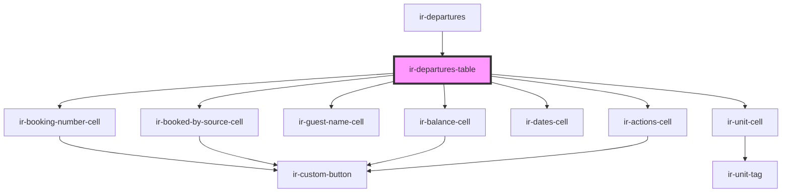

# ir-departures-table

<!-- Auto Generated Below -->

## Dependencies

### Used by

 - [ir-departures](..)

### Depends on

- [ir-booking-number-cell](../../table-cells/booking/ir-booking-number-cell)
- [ir-booked-by-source-cell](../../table-cells/booking/ir-booked-by-source-cell)
- [ir-guest-name-cell](../../table-cells/booking/ir-guest-name-cell)
- [ir-unit-cell](../../table-cells/booking/ir-unit-cell)
- [ir-dates-cell](../../table-cells/booking/ir-dates-cell)
- [ir-balance-cell](../../table-cells/booking/ir-balance-cell)
- [ir-actions-cell](../../table-cells/booking/ir-actions-cell)

### Graph

----------------------------------------------

*Built with [StencilJS](https://stenciljs.com/)*
