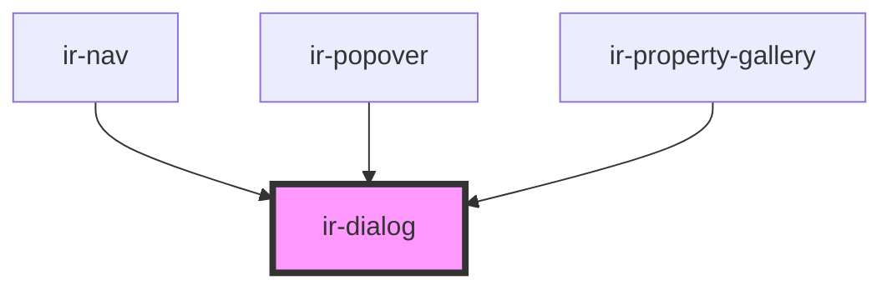

# ir-dialog

<!-- Auto Generated Below -->

## Events

| Event        | Description | Type                   |
| ------------ | ----------- | ---------------------- |
| `openChange` |             | `CustomEvent<boolean>` |

## Methods

### `closeModal() => Promise<void>`

#### Returns

Type: `Promise<void>`

### `openModal() => Promise<void>`

#### Returns

Type: `Promise<void>`

## Dependencies

### Used by

 - [ir-nav](../../ir-nav)
 - [ir-popover](../ir-popover)
 - [ir-property-gallery](../../ir-property-gallery)

### Graph

----------------------------------------------

*Built with [StencilJS](https://stenciljs.com/)*
