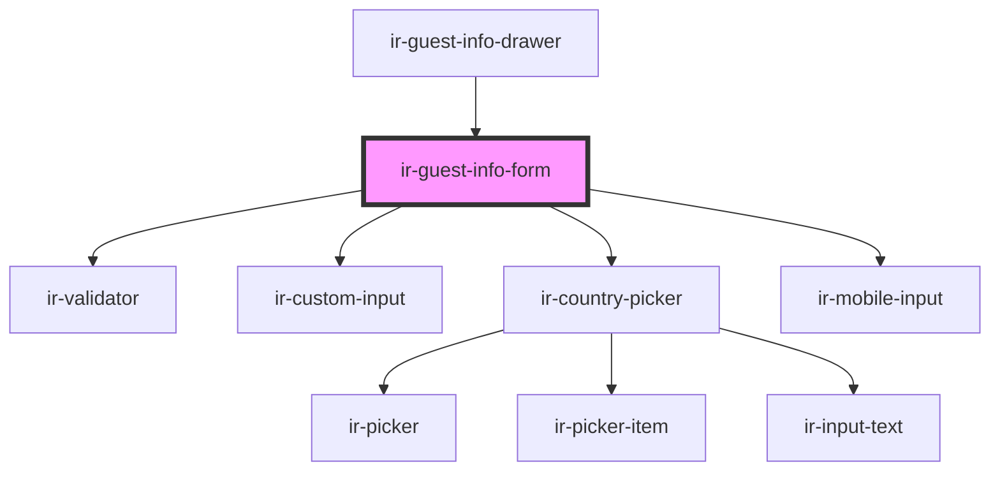

# ir-guest-info-form

<!-- Auto Generated Below -->

## Properties

| Property       | Attribute       | Description | Type         | Default     |
| -------------- | --------------- | ----------- | ------------ | ----------- |
| `autoValidate` | `auto-validate` |             | `boolean`    | `false`     |
| `countries`    | --              |             | `ICountry[]` | `undefined` |
| `guest`        | --              |             | `Guest`      | `undefined` |
| `language`     | `language`      |             | `string`     | `undefined` |

## Events

| Event          | Description | Type                 |
| -------------- | ----------- | -------------------- |
| `guestChanged` |             | `CustomEvent<Guest>` |

## Dependencies

### Used by

 - [ir-guest-info-drawer](../ir-guest-info-drawer)

### Depends on

- [ir-validator](../../ui/ir-validator)
- [ir-custom-input](../../ui/ir-custom-input)
- [ir-country-picker](../../ui/ir-country-picker)
- [ir-mobile-input](../../ui/ir-mobile-input)

### Graph

----------------------------------------------

*Built with [StencilJS](https://stenciljs.com/)*
