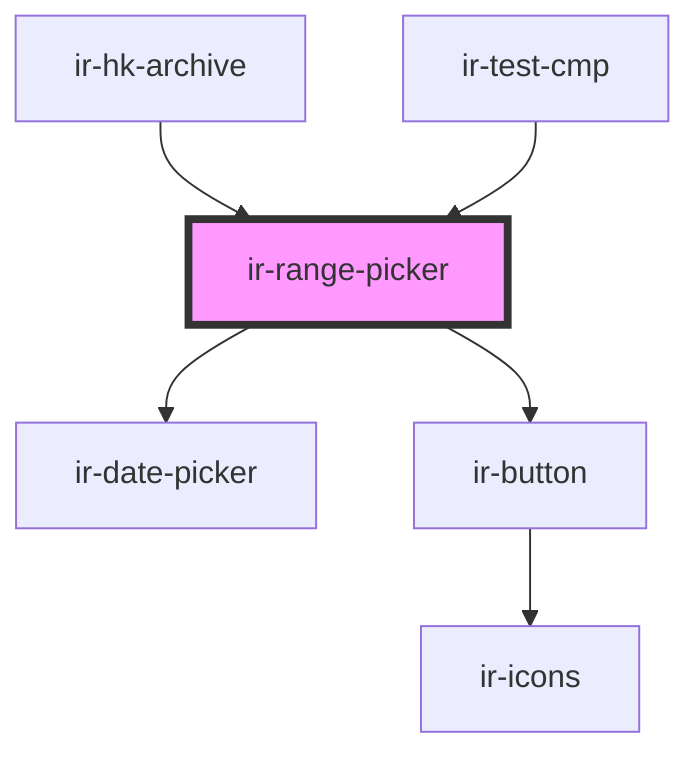

# ir-range-picker

<!-- Auto Generated Below -->

## Properties

| Property   | Attribute | Description | Type     | Default     |
| ---------- | --------- | ----------- | -------- | ----------- |
| `fromDate` | --        |             | `Moment` | `undefined` |
| `toDate`   | --        |             | `Moment` | `undefined` |

## Events

| Event              | Description | Type                                                 |
| ------------------ | ----------- | ---------------------------------------------------- |
| `dateRangeChanged` |             | `CustomEvent<{ fromDate: Moment; toDate: Moment; }>` |

## Dependencies

### Used by

 - [ir-hk-archive](..)
 - [ir-test-cmp](../../../../ir-test-cmp)

### Depends on

- [ir-date-picker](../../../../ui/ir-date-picker)
- [ir-button](../../../../ui/ir-button)

### Graph

----------------------------------------------

*Built with [StencilJS](https://stenciljs.com/)*
