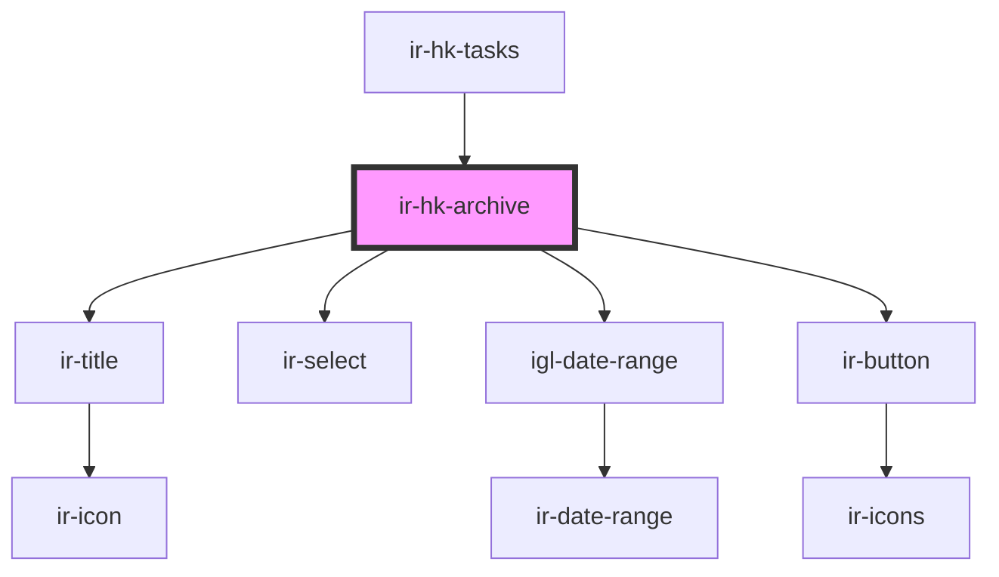

# ir-hk-archive

<!-- Auto Generated Below -->

## Properties

| Property     | Attribute     | Description | Type               | Default     |
| ------------ | ------------- | ----------- | ------------------ | ----------- |
| `propertyId` | `property-id` |             | `number \| string` | `undefined` |

## Dependencies

### Used by

 - [ir-hk-tasks](..)

### Depends on

- [ir-title](../../../ir-title)
- [ir-select](../../../ui/ir-select)
- [igl-date-range](../../../igloo-calendar/igl-date-range)
- [ir-button](../../../ui/ir-button)

### Graph

----------------------------------------------

*Built with [StencilJS](https://stenciljs.com/)*
