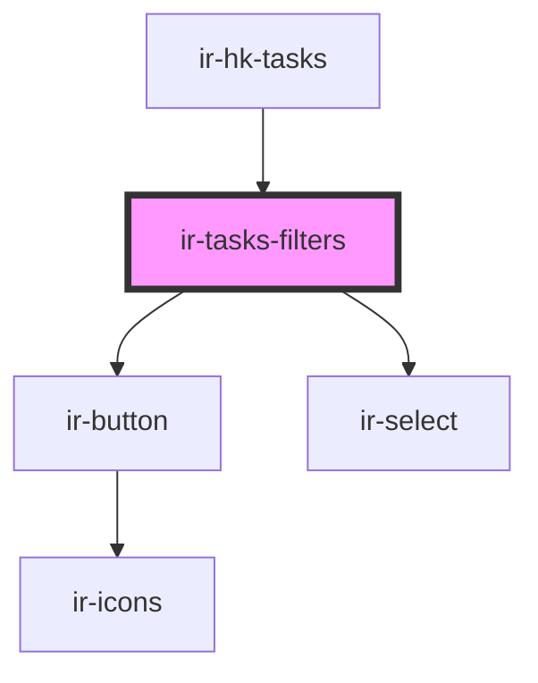

# ir-tasks-filters

<!-- Auto Generated Below -->

## Events

| Event          | Description | Type                                                                                                                                   |
| -------------- | ----------- | -------------------------------------------------------------------------------------------------------------------------------------- |
| `applyClicked` |             | `CustomEvent<{ period: string; housekeepers: string; cleaning_frequency: string; dusty_units: string; highlight_check_ins: string; }>` |
| `resetClicked` |             | `CustomEvent<{ period: string; housekeepers: string; cleaning_frequency: string; dusty_units: string; highlight_check_ins: string; }>` |

## Dependencies

### Used by

 - [ir-hk-tasks](..)

### Depends on

- [ir-button](../../../ir-button)
- [ir-select](../../../ir-select)

### Graph

----------------------------------------------

*Built with [StencilJS](https://stenciljs.com/)*
