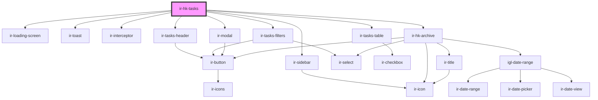

# ir-hk-tasks

<!-- Auto Generated Below -->

## Properties

| Property     | Attribute    | Description | Type     | Default     |
| ------------ | ------------ | ----------- | -------- | ----------- |
| `language`   | `language`   |             | `string` | `''`        |
| `p`          | `p`          |             | `string` | `undefined` |
| `propertyid` | `propertyid` |             | `number` | `undefined` |
| `ticket`     | `ticket`     |             | `string` | `''`        |

## Events

| Event                  | Description | Type                |
| ---------------------- | ----------- | ------------------- |
| `clearSelectedHkTasks` |             | `CustomEvent<void>` |

## Dependencies

### Depends on

- [ir-loading-screen](../../ir-loading-screen)
- [ir-toast](../../ui/ir-toast)
- [ir-interceptor](../../ir-interceptor)
- [ir-tasks-header](ir-tasks-header)
- [ir-tasks-filters](ir-tasks-filters)
- [ir-tasks-table](ir-tasks-table)
- [ir-modal](../../ui/ir-modal)
- [ir-sidebar](../../ui/ir-sidebar)
- [ir-hk-archive](ir-hk-archive)

### Graph

----------------------------------------------

*Built with [StencilJS](https://stenciljs.com/)*
