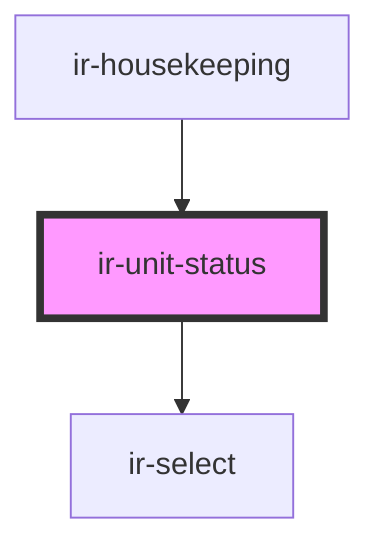

# ir-unit-status

<!-- Auto Generated Below -->

## Dependencies

### Used by

 - [ir-housekeeping](..)

### Depends on

- [ir-select](../../ir-select)

### Graph

----------------------------------------------

*Built with [StencilJS](https://stenciljs.com/)*
