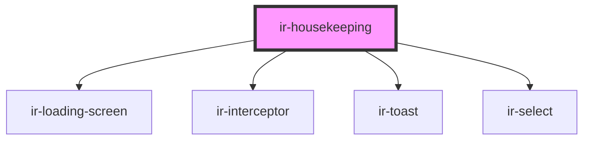

# ir-housekeeping

<!-- Auto Generated Below -->

## Properties

| Property     | Attribute    | Description | Type     | Default     |
| ------------ | ------------ | ----------- | -------- | ----------- |
| `baseurl`    | `baseurl`    |             | `string` | `''`        |
| `language`   | `language`   |             | `string` | `''`        |
| `propertyid` | `propertyid` |             | `number` | `undefined` |
| `ticket`     | `ticket`     |             | `string` | `''`        |

## Dependencies

### Depends on

- [ir-loading-screen](../ir-loading-screen)
- [ir-interceptor](../ir-interceptor)
- [ir-toast](../ir-toast)
- [ir-select](../ir-select)

### Graph

----------------------------------------------

*Built with [StencilJS](https://stenciljs.com/)*
