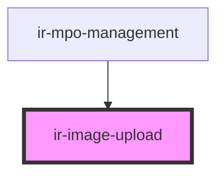

# ir-image-upload

<!-- Auto Generated Below -->

## Properties

| Property             | Attribute              | Description                                                                                                | Type      | Default                                                     |
| -------------------- | ---------------------- | ---------------------------------------------------------------------------------------------------------- | --------- | ----------------------------------------------------------- |
| `accept`             | `accept`               | Comma separated list of accepted mime types or file extensions. Defaults to the most common image formats. | `string`  | `'image/png,image/jpeg,image/webp,image/gif,image/svg+xml'` |
| `disabled`           | `disabled`             | Disables user interaction when true.                                                                       | `boolean` | `false`                                                     |
| `existingValueLabel` | `existing-value-label` | Optional label describing an existing uploaded resource.                                                   | `string`  | `undefined`                                                 |
| `footerText`         | `footer-text`          | Extra message shown below the helper text (useful for accepted formats, size limits, etc.).                | `string`  | `undefined`                                                 |
| `helperText`         | `helper-text`          | Helper text rendered beneath the dropzone.                                                                 | `string`  | `undefined`                                                 |
| `label`              | `label`                | Accessible label displayed above the dropzone.                                                             | `string`  | `undefined`                                                 |
| `maxFileSize`        | `max-file-size`        | Max file size in bytes. Default is 10MB.                                                                   | `number`  | `10 * 1024 * 1024`                                          |
| `maxFiles`           | `max-files`            | Maximum number of files allowed.                                                                           | `number`  | `1`                                                         |
| `replaceOnSelect`    | `replace-on-select`    | When true, clears previously selected files whenever new files are chosen.                                 | `boolean` | `true`                                                      |
| `value`              | --                     | Optional pre-selected files.                                                                               | `File[]`  | `[]`                                                        |

## Events

| Event           | Description                                                              | Type                                                           |
| --------------- | ------------------------------------------------------------------------ | -------------------------------------------------------------- |
| `fileRejected`  | Fired when a file is rejected due to type, size, or exceeding the limit. | `CustomEvent<{ fileName: string; reason: FileRejectReason; }>` |
| `filesSelected` | Fired whenever the list of selected files changes.                       | `CustomEvent<File[]>`                                          |

## Methods

### `clear() => Promise<void>`

Clears all selected files.

#### Returns

Type: `Promise<void>`

## Dependencies

### Used by

 - [ir-mpo-management](../ir-mpo-management)

### Graph

----------------------------------------------

*Built with [StencilJS](https://stenciljs.com/)*
