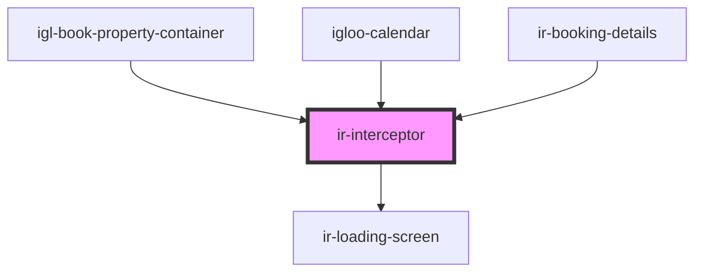

# ir-interceptor

<!-- Auto Generated Below -->

## Properties

| Property           | Attribute | Description | Type                                                | Default                                                                                |
| ------------------ | --------- | ----------- | --------------------------------------------------- | -------------------------------------------------------------------------------------- |
| `defaultMessage`   | --        |             | `{ loadingMessage: string; errorMessage: string; }` | `{     loadingMessage: 'Fetching Data',     errorMessage: 'Something Went Wrong',   }` |
| `handledEndpoints` | --        |             | `string[]`                                          | `['/ReAllocate_Exposed_Room']`                                                         |

## Events

| Event   | Description | Type                                                                                                 |
| ------- | ----------- | ---------------------------------------------------------------------------------------------------- |
| `toast` |             | `CustomEvent<ICustomToast & Partial<IToastWithButton> \| IDefaultToast & Partial<IToastWithButton>>` |

## Dependencies

### Used by

 - [igl-book-property-container](../igl-book-property-container)
 - [igloo-calendar](../igloo-calendar)
 - [ir-booking-details](../ir-booking-details)

### Depends on

- [ir-loading-screen](../ir-loading-screen)

### Graph

----------------------------------------------

*Built with [StencilJS](https://stenciljs.com/)*
