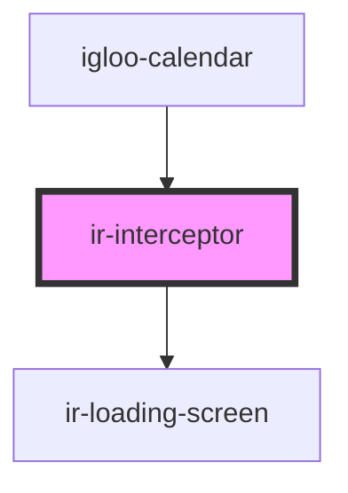

# ir-interceptor

<!-- Auto Generated Below -->

## Properties

| Property           | Attribute | Description | Type                                                                        | Default                                                                                                               |
| ------------------ | --------- | ----------- | --------------------------------------------------------------------------- | --------------------------------------------------------------------------------------------------------------------- |
| `defaultMessage`   | --        |             | `{ loadingMessage: string; successMessage: string; errorMessage: string; }` | `{     loadingMessage: 'Fetching Data',     successMessage: 'Success',     errorMessage: 'Something Went Wrong',   }` |
| `handledEndpoints` | --        |             | `string[]`                                                                  | `['/Get_Exposed_Booking_Availability', '/ReAllocate_Exposed_Room']`                                                   |

## Dependencies

### Used by

 - [igloo-calendar](../igloo-calendar)

### Depends on

- [ir-loading-screen](../ir-loading-screen)

### Graph

----------------------------------------------

*Built with [StencilJS](https://stenciljs.com/)*
