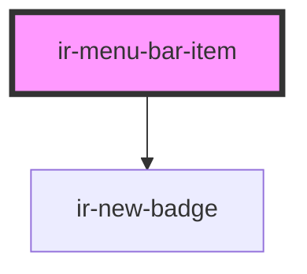

# ir-menu-bar-item


<!-- Auto Generated Below -->


## Properties

| Property   | Attribute | Description                                                                                                                                                                                                                                                                                                                               | Type                                         | Default     |
| ---------- | --------- | ----------------------------------------------------------------------------------------------------------------------------------------------------------------------------------------------------------------------------------------------------------------------------------------------------------------------------------------- | -------------------------------------------- | ----------- |
| `href`     | `href`    | The URL that the menu item should link to. When provided, the component renders as an `<a>` element.                                                                                                                                                                                                                                      | `string`                                     | `undefined` |
| `newBadge` | `new`     | Displays an `ir-new-badge` next to the trigger when set.                                                                                                                                                                                                                                                                                  | `boolean`                                    | `false`     |
| `target`   | `target`  | Specifies where to open the linked document. Mirrors the native HTML `target` attribute.  Possible values: - `_self` — Opens the link in the same browsing context (default) - `_blank` — Opens the link in a new tab or window - `_parent` — Opens the link in the parent frame - `_top` — Opens the link in the full body of the window | `"_blank" \| "_parent" \| "_self" \| "_top"` | `undefined` |


## Events

| Event                 | Description                                                                                                                                                                                                                                                                                                                                                                                                                                                                         | Type                      |
| --------------------- | ----------------------------------------------------------------------------------------------------------------------------------------------------------------------------------------------------------------------------------------------------------------------------------------------------------------------------------------------------------------------------------------------------------------------------------------------------------------------------------- | ------------------------- |
| `menu-bar-item-click` | Emitted when the menu bar item is clicked.  This event bubbles up from both linked (`<a>`) and non-linked (`<button>`-like) items. You can call `event.preventDefault()` on the listener to stop the default navigation when the item has an `href`.  Example: ```js document.querySelector('ir-menu-bar-item').addEventListener('menu-bar-item-click', e => {   e.preventDefault(); // prevents navigation if the item has an href   console.log('Menu item clicked:', e); }); ``` | `CustomEvent<MouseEvent>` |


## Shadow Parts

| Part     | Description |
| -------- | ----------- |
| `"item"` |             |


## Dependencies

### Depends on

- [ir-new-badge](../../ir-new-badge)

### Graph


----------------------------------------------

*Built with [StencilJS](https://stenciljs.com/)*
