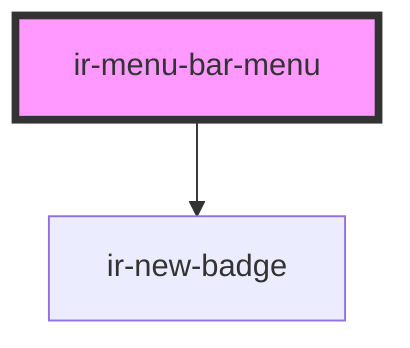

# ir-menu-bar-menu

<!-- Auto Generated Below -->

## Properties

| Property   | Attribute | Description                                                                                            | Type      | Default |
| ---------- | --------- | ------------------------------------------------------------------------------------------------------ | --------- | ------- |
| `newBadge` | `new`     | Displays an `ir-new-badge` next to the trigger when set.                                               | `boolean` | `false` |
| `open`     | `open`    | Controls the open state of the dropdown menu. Can be toggled programmatically or via user interaction. | `boolean` | `false` |

## Events

| Event               | Description                                     | Type                   |
| ------------------- | ----------------------------------------------- | ---------------------- |
| `menuBarOpenChange` | Fires whenever the menu's `open` state changes. | `CustomEvent<boolean>` |

## Shadow Parts

| Part              | Description |
| ----------------- | ----------- |
| `"dropdown"`      |             |
| `"new-indicator"` |             |
| `"trigger"`       |             |

## Dependencies

### Depends on

- [ir-new-badge](../../ir-new-badge)

### Graph

----------------------------------------------

*Built with [StencilJS](https://stenciljs.com/)*
