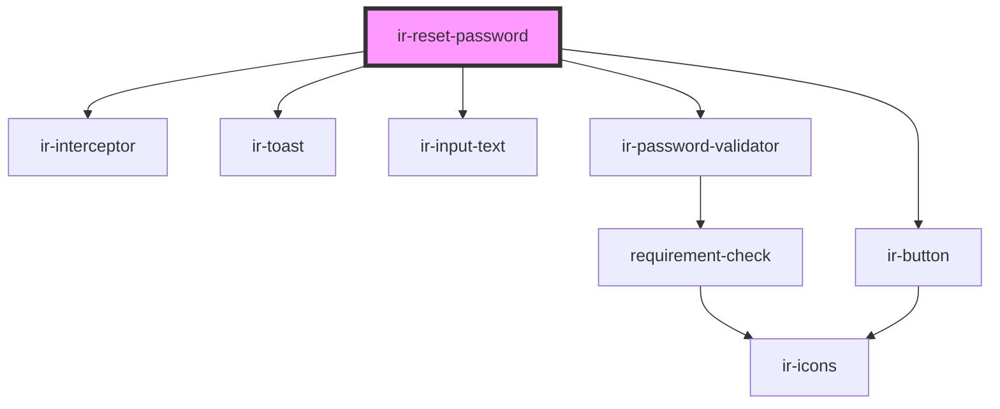

# ir-reset-password

<!-- Auto Generated Below -->

## Events

| Event        | Description | Type                                                           |
| ------------ | ----------- | -------------------------------------------------------------- |
| `authFinish` |             | `CustomEvent<{ token: string; code: "error" \| "succsess"; }>` |

## Dependencies

### Depends on

- [ir-interceptor](../ir-interceptor)
- [ir-toast](../ui/ir-toast)
- [ir-input-text](../ui/ir-input-text)
- [ir-password-validator](../ir-password-validator)
- [ir-button](../ui/ir-button)

### Graph

----------------------------------------------

*Built with [StencilJS](https://stenciljs.com/)*
