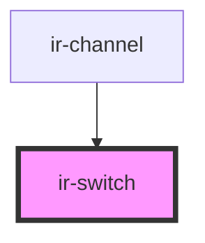

# ir-switch

<!-- Auto Generated Below -->

## Properties

| Property   | Attribute   | Description | Type      | Default     |
| ---------- | ----------- | ----------- | --------- | ----------- |
| `checked`  | `checked`   |             | `boolean` | `false`     |
| `disabled` | `disabled`  |             | `boolean` | `false`     |
| `switchId` | `switch-id` |             | `string`  | `undefined` |

## Events

| Event         | Description | Type                   |
| ------------- | ----------- | ---------------------- |
| `checkChange` |             | `CustomEvent<boolean>` |

## Dependencies

### Used by

 - [ir-channel](../ir-channel)

### Graph

----------------------------------------------

*Built with [StencilJS](https://stenciljs.com/)*
