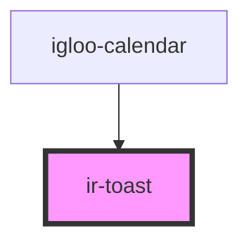

# ir-toast

<!-- Auto Generated Below -->

## Properties

| Property   | Attribute  | Description | Type                                                           | Default         |
| ---------- | ---------- | ----------- | -------------------------------------------------------------- | --------------- |
| `position` | `position` |             | `"bottom-left" \| "bottom-right" \| "top-left" \| "top-right"` | `'bottom-left'` |

## Methods

### `hideToast() => Promise<void>`

#### Returns

Type: `Promise<void>`

### `showToast() => Promise<void>`

#### Returns

Type: `Promise<void>`

## Dependencies

### Used by

 - [igloo-calendar](../igloo-calendar)

### Graph

----------------------------------------------

*Built with [StencilJS](https://stenciljs.com/)*
