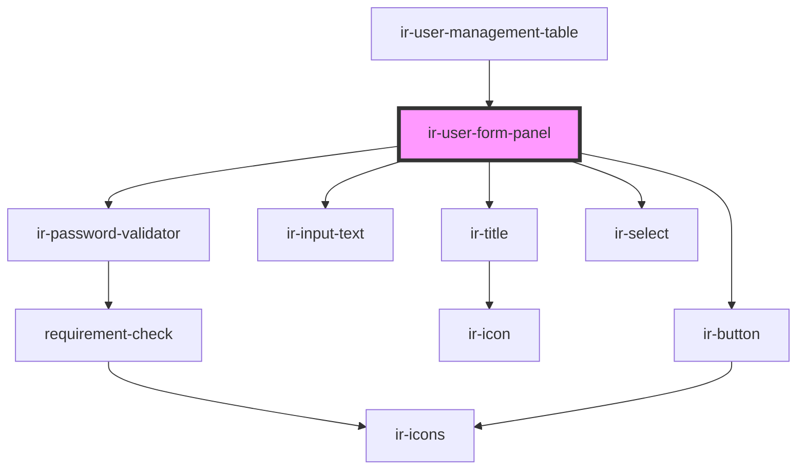

# ir-user-form-panel

<!-- Auto Generated Below -->

## Properties

| Property       | Attribute        | Description | Type                                                                                                                            | Default     |
| -------------- | ---------------- | ----------- | ------------------------------------------------------------------------------------------------------------------------------- | ----------- |
| `isEdit`       | `is-edit`        |             | `boolean`                                                                                                                       | `false`     |
| `isSuperAdmin` | `is-super-admin` |             | `boolean`                                                                                                                       | `undefined` |
| `language`     | `language`       |             | `string`                                                                                                                        | `'en'`      |
| `property_id`  | `property_id`    |             | `number`                                                                                                                        | `undefined` |
| `user`         | --               |             | `THKUser & { is_active: boolean; last_signed_in: string; created_at: string; password: string; email: string; role?: string; }` | `undefined` |

## Events

| Event          | Description | Type                |
| -------------- | ----------- | ------------------- |
| `closeSideBar` |             | `CustomEvent<null>` |
| `resetData`    |             | `CustomEvent<null>` |

## Dependencies

### Used by

 - [ir-user-management-table](../ir-user-management-table)

### Depends on

- [ir-title](../../ir-title)
- [ir-input-text](../../ui/ir-input-text)
- [ir-password-validator](../../ir-password-validator)
- [ir-select](../../ui/ir-select)
- [ir-button](../../ui/ir-button)

### Graph

----------------------------------------------

*Built with [StencilJS](https://stenciljs.com/)*
