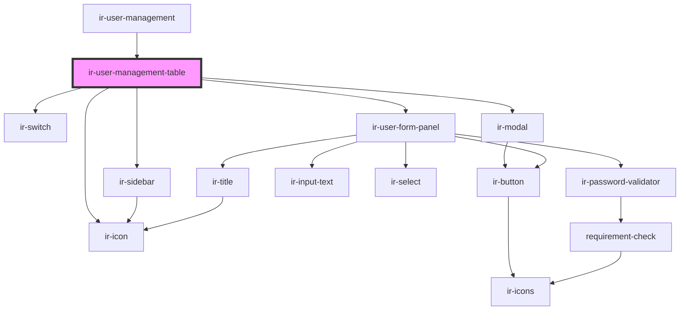

# ir-user-management-table

<!-- Auto Generated Below -->

## Properties

| Property       | Attribute        | Description | Type      | Default     |
| -------------- | ---------------- | ----------- | --------- | ----------- |
| `isSuperAdmin` | `is-super-admin` |             | `boolean` | `undefined` |
| `users`        | --               |             | `User[]`  | `[]`        |

## Events

| Event   | Description | Type                                                                                                 |
| ------- | ----------- | ---------------------------------------------------------------------------------------------------- |
| `toast` |             | `CustomEvent<ICustomToast & Partial<IToastWithButton> \| IDefaultToast & Partial<IToastWithButton>>` |

## Dependencies

### Used by

 - [ir-user-management](..)

### Depends on

- [ir-icon](../../ui/ir-icon)
- [ir-switch](../../ui/ir-switch)
- [ir-sidebar](../../ui/ir-sidebar)
- [ir-modal](../../ui/ir-modal)
- [ir-user-form-panel](../ir-user-form-panel)

### Graph

----------------------------------------------

*Built with [StencilJS](https://stenciljs.com/)*
