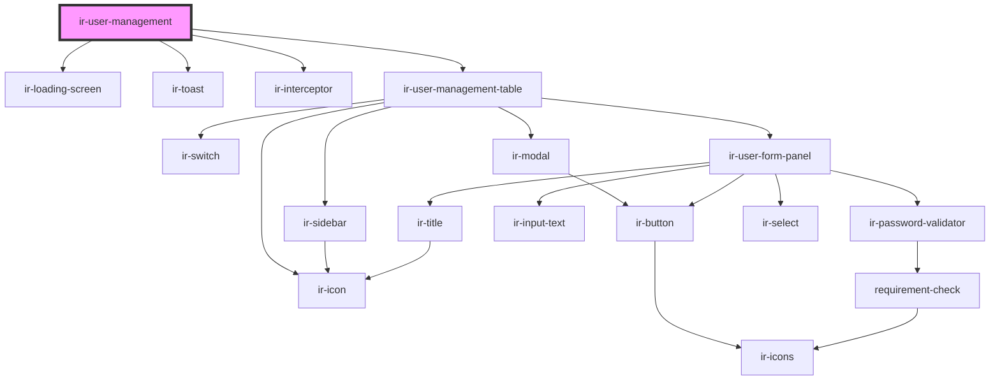

# ir-user-management

<!-- Auto Generated Below -->

## Properties

| Property       | Attribute        | Description | Type      | Default     |
| -------------- | ---------------- | ----------- | --------- | ----------- |
| `isSuperAdmin` | `is-super-admin` |             | `boolean` | `true`      |
| `language`     | `language`       |             | `string`  | `''`        |
| `p`            | `p`              |             | `string`  | `undefined` |
| `propertyid`   | `propertyid`     |             | `number`  | `undefined` |
| `ticket`       | `ticket`         |             | `string`  | `''`        |

## Dependencies

### Depends on

- [ir-loading-screen](../ir-loading-screen)
- [ir-toast](../ui/ir-toast)
- [ir-interceptor](../ir-interceptor)
- [ir-user-management-table](ir-user-management-table)

### Graph

----------------------------------------------

*Built with [StencilJS](https://stenciljs.com/)*
