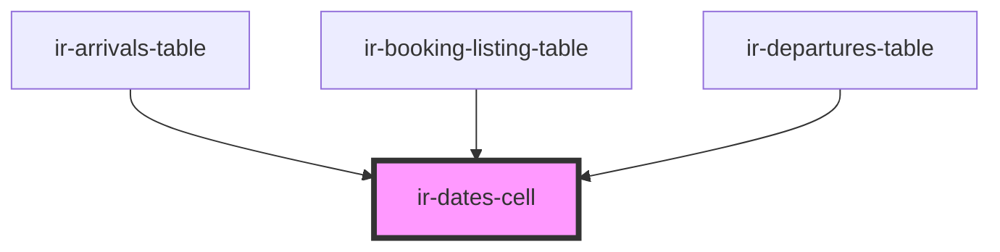

# ir-dates-cell

<!-- Auto Generated Below -->

## Properties

| Property          | Attribute          | Description | Type      | Default     |
| ----------------- | ------------------ | ----------- | --------- | ----------- |
| `checkIn`         | `check-in`         |             | `string`  | `undefined` |
| `checkOut`        | `check-out`        |             | `string`  | `undefined` |
| `overdueCheckin`  | `overdue-checkin`  |             | `boolean` | `undefined` |
| `overdueCheckout` | `overdue-checkout` |             | `boolean` | `undefined` |

## Dependencies

### Used by

 - [ir-arrivals-table](../../../ir-arrivals/ir-arrivals-table)
 - [ir-booking-listing-table](../../../ir-booking-listing/ir-booking-listing-table)
 - [ir-departures-table](../../../ir-departures/ir-departures-table)

### Graph

----------------------------------------------

*Built with [StencilJS](https://stenciljs.com/)*
