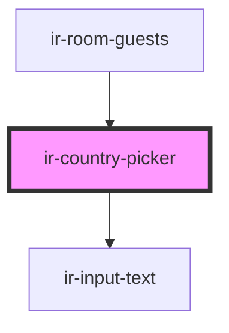

# ir-country-picker

<!-- Auto Generated Below -->

## Properties

| Property          | Attribute | Description | Type         | Default     |
| ----------------- | --------- | ----------- | ------------ | ----------- |
| `countries`       | --        |             | `ICountry[]` | `[]`        |
| `country`         | --        |             | `ICountry`   | `undefined` |
| `error`           | `error`   |             | `boolean`    | `undefined` |
| `propertyCountry` | --        |             | `ICountry`   | `undefined` |

## Events

| Event           | Description | Type                    |
| --------------- | ----------- | ----------------------- |
| `countryChange` |             | `CustomEvent<ICountry>` |

## Dependencies

### Used by

 - [ir-room-guests](../../ir-booking-details/ir-room-guests)

### Depends on

- [ir-input-text](../../ir-input-text)

### Graph

----------------------------------------------

*Built with [StencilJS](https://stenciljs.com/)*
